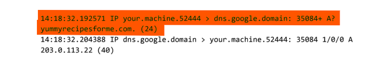
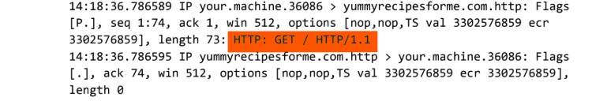
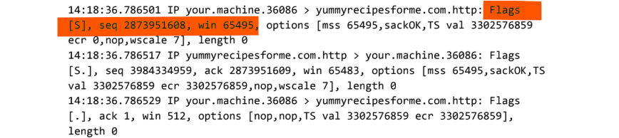
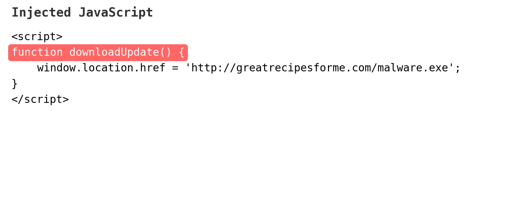
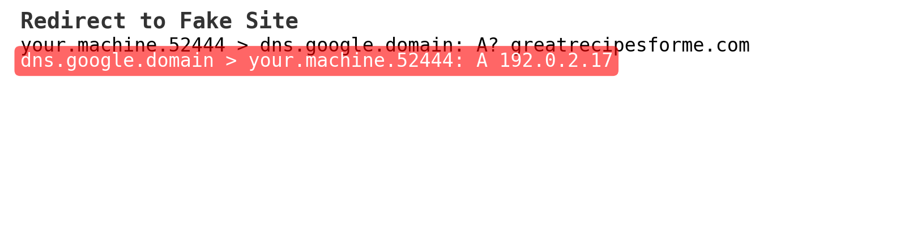
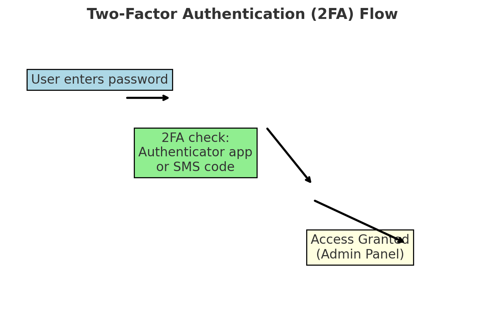

# Security Incident Report – YummyRecipesForMe.com  

This project is part of the **Google Cybersecurity Certificate course**.  
I investigated a **real-world style web compromise** and documented the full incident from start to finish.  

### The case strengthens my ability to:

- Analyze tcpdump network logs
- Identify network protocols in an attack
- Document an incident in detail
- Recommend security improvements to prevent future attacks


---

## Project Overview  

The website `yummyrecipesforme.com` was compromised after a **brute force attack** on the admin account by a disgruntled ex-employee.  
The attacker logged in with the **default password**, edited the site’s **source code**, and injected malicious JavaScript.  

When visitors loaded the website:  
- They were prompted to **download a fake “browser update” file**.  
- Running the file redirected them to a **malicious clone site**: `greatrecipesforme.com`.  
- Customers later reported **slow systems** and suspicious downloads.  

I used a provided **tcpdump log** to analyze the attack sequence and document what happened.  

---

## Step 1: Network Protocols Identified  

From the tcpdump logs, I found the following protocols:  

1. **DNS (Domain Name System)**  
   - Resolves domain names to IP addresses.  
   - Example:  
     ```
     your.machine > dns.google.domain: A? yummyrecipesforme.com  
     dns.google.domain > your.machine: A 203.0.113.22
     ```  
   

2. **HTTP (Hypertext Transfer Protocol)**  
   - Used by the browser to request pages from both websites.  
   - Example:  
     ```
     HTTP: GET / HTTP/1.1
     ```    


3. **TCP (Transmission Control Protocol)**  
   - Manages reliable connections (SYN, SYN-ACK, ACK).  
   - Example:  
     ```
     Flags [S], seq..., win..., options...
     ```  
   

---

## Step 2: Incident Documentation  

- **Where it happened:** On the website server `yummyrecipesforme.com`.  
- **How it happened:**  
  - Attacker brute forced the admin login.  
  - They embedded **JavaScript** that triggered a malware download.  
  - After execution, users were redirected to `greatrecipesforme.com`.  
- **Discovery:** Customers emailed support after noticing forced downloads and redirects.  
- **Impact:**  
  - Users’ computers were infected with malware.  
  - Trust in the company was reduced.  
  - Admin access was locked after the attacker changed the password.  


 

---

## Step 3: Recommended Security Action  

**Recommendation:** Implement **Two-Factor Authentication (2FA)** for all admin accounts.  

- Even if attackers guess the password, they cannot access the system without a second factor (e.g., authenticator app or token).  
- This significantly lowers the risk of successful brute force attacks.  



---

## Full Incident Report  

For a detailed write-up of this incident, read the full report here:  

 

---

## Key Takeaways:

- Default/weak passwords leave systems wide open and vulnerable.  
- Log analysis (DNS - HTTP - Redirect) helps track attack flow.  
- **2FA** is a strong defense against brute force login attempts.  

---


